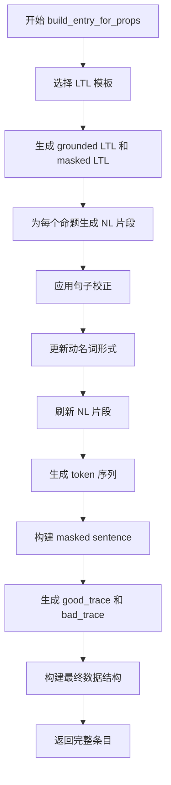

# LTL 数据集生成器详解

## 概述

`LTL_dataset_generator.py` 是一个用于生成自然语言 ↔ LTL（线性时序逻辑）数据集的脚本。它支持多种场景（如仓库、物流中心等），能够自动生成标注数据，用于训练和评估 NL2LTL（自然语言到 LTL 翻译）模型。

## 整体架构

```
┌─────────────────────────────────────────────────────────────────┐
│                         main() 入口点                            │
│  -s/--scenario: 选择场景 (默认: warehouse)                       │
│  -n/--num_entries: 生成样本数量 (默认: 10000)                    │
│  -o/--output: 输出文件路径                                       │
└────────────────────────────┬────────────────────────────────────┘
                             │
                             ▼
┌─────────────────────────────────────────────────────────────────┐
│                    load_scenario()                              │
│  加载场景配置: 物体同义词、动作配置、位置列表                     │
└────────────────────────────┬────────────────────────────────────┘
                             │
                             ▼
┌─────────────────────────────────────────────────────────────────┐
│                 build_dataset_entries()                         │
│  主循环: 生成指定数量的有效数据集条目                             │
└────────────────────────────┬────────────────────────────────────┘
                             │
              ┌──────────────┼──────────────┐
              ▼              ▼              ▼
┌──────────────────┐ ┌──────────────────┐ ┌──────────────────┐
│  1. 采样命题     │ │ 2. 构建条目      │ │ 3. 验证并保留    │
│  - 选择标签      │ │ - 选择 LTL 模板  │ │ - 检查完整性     │
│  - 生成动作参数  │ │ - 生成 NL 句子   │ │ - 重新生成无效   │
└──────────────────┘ └──────────────────┘ └──────────────────┘
```

## 核心组件详解

### 1. NLTK 工具初始化 (第22-51行)

```python
_ensure_nltk_resource("punkt_tab", "tokenizers/punkt_tab")   # 分词器
_ensure_nltk_resource("punkt", "tokenizers/punkt")           # 分词器
_ensure_nltk_resource("averaged_perceptron_tagger", "taggers/averaged_perceptron_tagger")  # POS标注
_ensure_nltk_resource("wordnet", "corpora/wordnet")          # 词形还原

_LEM = WordNetLemmatizer()       # 词形还原器
_DETOK = TreebankWordDetokenizer()  # 句子去分词器
```

**关键常量**：
- `_REQUIRES_GERUND`: 需要动名词形式的动词集合
- `_PUNCT`: 标点符号集合
- `_PLACEHOLDER_RE`: 匹配 `prop_X` 占位符的正则

### 2. 场景加载 (第66-88行)

```python
def load_scenario(scenario_name: str) -> Tuple[Dict, Dict, Dict, List[str], Dict]:
    """
    返回:
        cfg: 完整 YAML 配置
        object_dict: {canonical -> [synonyms]}
        actions_dict: {verb -> [NL synonyms]}
        locations: 位置列表
        actions_cfg: 动作参数配置
    """
```

**数据来源**：
- `scenarios.yaml`: 场景定义文件
- `object_names.txt`: 物体名称同义词

### 3. LTL 模板系统

#### 3.1 基础 LTL 模板 (第108-117行)

```python
LTL_TEMPLATES_STATE = [
    ("F_NOT", 1, lambda P: ["finally", "(", "not", P[0], ")"]),
    ("G_NOT", 1, lambda P: ["globally", "(", "not", P[0], ")"]),
    ("F_AND", 2, lambda P: ["finally", "(", P[0], "and", P[1], ")"]),
    ("G_AND", 2, lambda P: ["globally", "(", P[0], "and", P[1], ")"]),
    ("F_OR",  2, lambda P: ["finally", "(", P[0], "or", P[1], ")"]),
    ("G_OR",  2, lambda P: ["globally", "(", P[0], "or", P[1], ")"]),
    ("X",     1, lambda P: ["next", P[0]]),
    ("U",     2, lambda P: ["(", P[0], "until", P[1], ")"]),
]
```

**模板格式**: `(名称, 参数数量, 生成函数)`

| 模板 | LTL 含义 | 中文解释 |
|------|----------|----------|
| `F_NOT` | ◇¬p | 最终不发生 |
| `G_NOT` | □¬p | 永远不发生 |
| `F_AND` | ◇(p∧q) | 最终同时发生 |
| `G_AND` | □(p∧q) | 永远同时发生 |
| `F_OR` | ◇(p∨q) | 最终至少一个发生 |
| `G_OR` | □(p∨q) | 永远至少一个发生 |
| `X` | Xp | 下一时刻发生 |
| `U` | pUq | p 保持到 q 发生 |

#### 3.2 扩展 LTL 模板 (第442-593行)

增加了36个更复杂的模板，包括：

| 编号 | 模板名 | LTL 含义 |
|------|--------|----------|
| 1 | `G_IMPL_F` | □(a → ◇b) |
| 2 | `G_NOT_AND` | □¬(a∧b) |
| 3 | `G_IMPL_XXX` | □(a → XXX b) |
| 4 | `U_GF` | a U (□◇b) |
| ... | ... | ... |
| 24 | `G_ALWAYS_A` | □a |
| 36 | `UNTIL_OR_ALWAYS` | (a U b) ∨ □a |

#### 3.3 追踪生成器 (第143-425行)

每个 LTL 模板对应一个追踪生成函数，生成**正例追踪**和**反例追踪**：

```python
def _trace_for_F_AND(p, q, good=True):
    """F (p ∧ q) - 最终 p 和 q 同时为真"""
    if good:
        return [[], [p], [p, q]]  # 正例: t2 时刻两者都为真
    else:
        return [[], [p], []]       # 反例: 从未同时为真

def _trace_for_G_NOT(p, good=True):
    """G (¬p) - p 永远不为真"""
    return [[]] * 3 if good else [[p]] + [[]] * 2

def _trace_for_X(p, good=True):
    """X p - 下一时刻 p 为真"""
    return [[], [p]] if good else [[p]]
```

**追踪数据结构**: 列表的列表，每个内层列表表示该时刻为真的命题集合

```python
# 示例: F (p ∧ q) 的正例追踪
[[], [], ['photograph(jaywalker)', 'go_to(west_8th_avenue')]]
# t0: 无命题为真
# t1: 无命题为真  
# t2: 两个命题同时为真
```

### 4. 自然语言模板

#### 4.1 基础语义模板 (第119-130行)

```python
SEMANTIC_TEMPLATES = {
    "F_NOT": [lambda s: f"eventually, avoid {s[0]}."],
    "G_NOT": [lambda s: f"always avoid {s[0]}."],
    "F_AND": [lambda s: f"eventually {s[0]} and {s[1]}."],
    "G_AND": [lambda s: f"always maintain both {s[0]} and {s[1]}."],
    "F_OR":  [lambda s: f"eventually {s[0]} or {s[1]}."],
    "G_OR":  [lambda s: f"always have either {s[0]} or {s[1]}."],
    "NOT":   [lambda s: f"never {s[0]}.", lambda s: f"avoid {s[0]} at all costs."],
    "AND":   [lambda s: f"{s[0]} and {s[1]}.", lambda s: f"ensure both {s[0]} and {s[1]}."],
    "OR":    [lambda s: f"{s[0]} or {s[1]}."],
}
```

#### 4.2 扩展语义模板 (第598-635行)

为扩展的 LTL 模板提供自然语言表达：

| LTL 模板 | 自然语言示例 |
|----------|--------------|
| `G_IMPL_F` | "Globally, if {s[0]} occurs then finally {s[1]} happens." |
| `G_NOT_AND` | "Globally, it is not the case that both {s[0]} and {s[1]} hold simultaneously." |
| `G_IMPL_XXX` | "Whenever {s[0]} holds, {s[1]} holds exactly three steps later." |
| `FG_NOT` | "From some point onwards, {s[0]} never occurs again." |

### 5. 句子处理工具

#### 5.1 动名词转换 (第94-101行)

```python
def _to_gerund(word: str) -> str:
    """将动词转换为动名词形式"""
    if word.endswith("ie"):
        return word[:-2] + "ying"   # die -> dying
    if word.endswith("e") and not word.endswith("ee"):
        return word[:-1] + "ing"    # make -> making
    if len(word) > 2 and re.match(r"[aeiou][^aeiouywx]$", word[-2:]):
        return word + "ing"          # run -> running
    return word + "ing"              # default
```

#### 5.2 句子校正 (第651-681行)

[`correct_sentence()`](dataset_generators/LTL_dataset_generator.py:651) 函数：
1. 应用动名词规则（特定动词后需要动名词）
2. 将 "i" 转换为 "I"
3. 首字母大写
4. 标点后单词首字母大写

#### 5.3 Ego 参考添加 (第644-648行)

```python
def add_ego_reference(sentence: str, ego: str) -> str:
    """为句子添加主语（如 'The robot', 'You' 等）"""
    if first_word in VERB_LIKE_STARTS:
        return f"{ego} must {sentence}"
    return sentence
```

### 6. 命题片段生成 (第715-758行)

[`_nl_segment()`](dataset_generators/LTL_dataset_generator.py:715) 根据参数类型生成自然语言片段：

| 参数类型 | 句式模板 | 示例 |
|----------|----------|------|
| 0参数 | `v_ref` | "idle" |
| 1参数 (item/person/threat/target) | `v_ref the obj` | "photograph the jaywalker" |
| 2参数 (item, location) | `v_ref the obj to the loc` | "deliver the box to the shelf" |
| 2参数 (traffic_target, lane) | `v_ref the tgt on/at lane` | "photograph the pedestrian on north 1st street" |

### 7. 单条目构建流程 (第690-838行)



**数据结构**：

```python
{
    "id": 0,                                    # 样本 ID
    "sentence": ["You", "must", "photograph", "the", "jaywalker", "..."],  # 完整 NL
    "tl": ["finally", "(", "photograph_the_jaywalker", ")"],  # Grounded LTL
    "masked_tl": ["finally", "(", "prop_1", ")"],  # 抽象 LTL
    "grounded_sentence": ["You", "must", "prop_1", "..."],  # 替换为 prop_X
    "lifted_sentence_prop_ids": [0, 0, 1, 2, 0, ...],  # token 对应的命题 ID
    "prop_dict": {
        "prop_1": {
            "action_canon": "photograph",
            "action_ref": "photograph",
            "args_canon": ["jaywalker"],
            "args_ref": ["jaywalker"]
        }
    },
    "good_trace": [[], [], ["photograph(jaywalker)"]],  # 满足公式的追踪
    "bad_trace": [["photograph(jaywalker)"], [], []]    # 违反公式的追踪
}
```

### 8. 参数采样 (第844-906行)

[`_sample_argument()`](dataset_generators/LTL_dataset_generator.py:844) 为动作生成随机参数：

| 参数类型 | 生成方式 | 示例 |
|----------|----------|------|
| `item` | 随机选择物体 | "box", "screwdriver", "sensor_kit" |
| `location` | 随机选择位置 | "shelf_A", "loading_dock", "packing_area_2" |
| `person` | 形容词+人物 | "injured_victim", "safe_rescuer", "hostile_person" |
| `threat` | 形容词+威胁 | "active_gas_leak", "nearest_fire_source", "impending_flood" |
| `lane` | 方向+序号+道路 | "north_1st_street", "east_3rd_avenue" |
| `traffic_target` | 目标类型 | "pedestrian", "vehicle", "jaywalker", "cyclist" |
| `color` | 颜色 | "red", "yellow", "green" |
| `light` | 位置+light | "north_light", "south_light" |

### 9. 数据集构建主循环 (第928-986行)

```python
def build_dataset_entries(
    object_dict: Dict,
    actions_dict: Dict,
    locations: List[str],
    actions_cfg: Dict,
    num_entries: int,
    max_props: int = 3,
) -> List[Dict]:
    """
    生成指定数量的有效数据集条目
    
    验证规则:
    1. 所有 prop_i 必须出现在 lifted_sentence_prop_ids
    2. 所有 prop_i 必须出现在 grounded_sentence
    """
    dataset = []
    
    while len(dataset) < num_entries:
        # 1. 随机选择 1-max_props 个命题标签
        want_labels = random.sample(label_pool, k=random.randint(1, max_props))
        
        # 2. 为每个标签生成随机命题
        for lbl in want_labels:
            verb = random.choice(list(actions_dict.keys()))
            a_canon, a_ref = [], []
            for kind in actions_cfg[verb]["params"]:
                c, r = _sample_argument(kind, object_dict, locations)
                a_canon.append(c)
                a_ref.append(r)
            # ... 构建命题字典
        
        # 3. 构建条目
        entry = build_entry_for_props(tmp_idx, props, actions_cfg)
        
        # 4. 验证并保留
        if _entry_is_valid(entry):
            dataset.append(entry)
        # 无效则重新生成
    
    return dataset
```

### 10. 场景配置示例

`scenarios.yaml` 配置结构：

```yaml
warehouse:
  locations:
    - shelf_A
    - shelf_B
    - loading_dock
    - packing_area
    - inventory_zone
  actions:
    pick:
      params: ["item"]
      examples: ["pick up", "grab", "collect"]
    place:
      params: ["item", "location"]
      examples: ["put", "place", "set down"]
    move:
      params: ["location"]
      examples: ["go to", "move to", "navigate to"]
    count:
      params: ["item"]
      examples: ["count", "tally", "check"]

search_and_rescue:
  locations:
    - building_alpha
    - rubble_zone
    - triage_area
    - command_center
  actions:
    rescue:
      params: ["person"]
      examples: ["rescue", "save", "extract"]
    medic:
      params: ["person"]
      examples: ["provide medical aid to", "treat"]
    scan:
      params: ["threat"]
      examples: ["scan for", "detect"]
```

## 使用方法

```bash
# 生成默认场景 (warehouse) 的 10000 条数据
python dataset_generators/LTL_dataset_generator.py

# 生成指定场景的数据
python dataset_generators/LTL_dataset_generator.py -s search_and_rescue

# 自定义输出数量和路径
python dataset_generators/LTL_dataset_generator.py -n 5000 -o custom_output.jsonl
```

## 输出示例

生成的数据存储为 JSONL 格式（每行一个 JSON 对象）：

```jsonl
{"id": 0, "sentence": ["You", "must", "eventually", "photograph", "the", "jaywalker", "and", "deliver", "the", "box", "to", "the", "shelf", "."], "tl": ["finally", "(", "photograph(jaywalker)", "and", "deliver(box,shelf)", ")"], "masked_tl": ["finally", "(", "prop_1", "and", "prop_2", ")"], "grounded_sentence": ["You", "must", "eventually", "prop_1", "and", "prop_2", "."], "lifted_sentence_prop_ids": [0, 0, 0, 1, 0, 0, 0, 2, 0, 2, 0, 2, 2, 0], "prop_dict": {"prop_1": {"action_canon": "photograph", "action_ref": "photograph", "args_canon": ["jaywalker"], "args_ref": ["jaywalker"]}, "prop_2": {"action_canon": "deliver", "action_ref": "deliver", "args_canon": ["box", "shelf_A"], "args_ref": ["box", "shelf A"]}}, "good_trace": [[], [], ["photograph(jaywalker)", "deliver(box,shelf_A)"]], "bad_trace": [[], [], []]}
{"id": 1, "sentence": ["The", "robot", "must", "always", "avoid", "go_to", "the", "danger_zone", "."], "tl": ["globally", "(", "not", "go_to(danger_zone)", ")"], "masked_tl": ["globally", "(", "not", "prop_1", ")"], "grounded_sentence": ["The", "robot", "must", "always", "avoid", "prop_1", "."], "lifted_sentence_prop_ids": [0, 0, 0, 0, 0, 1, 0], "prop_dict": {"prop_1": {"action_canon": "go_to", "action_ref": "go to", "args_canon": ["danger_zone"], "args_ref": ["danger zone"]}}, "good_trace": [[], [], []], "bad_trace": [["go_to(danger_zone)"], [], []]}
```

## 设计特点

### 1. 双重追踪系统
每个样本包含：
- `good_trace`: 满足 LTL 公式的示例追踪
- `bad_trace`: 违反 LTL 公式的反例追踪

可用于：
- 强化学习训练
- 对比学习方法
- 公式验证

### 2. Masked LTL
模板中的命题被替换为 `prop_X` 占位符：
- `finally ( photograph(jaywalker) )` → `finally ( prop_1 )`
- `globally ( not go_to(danger_zone) )` → `globally ( not prop_1 )`

这使得模型能够学习抽象的 LTL 模式，而非记忆具体的命题。

### 3. 场景感知
支持多种场景，每种场景有：
- 特定的物体名称
- 特定的动作集合
- 特定的位置列表

### 4. 自然语言多样性
- 多个同义词选项（pick up / grab / collect）
- 多个语义模板选项
- 动名词形式自动处理
- 代词和大小写规范化
