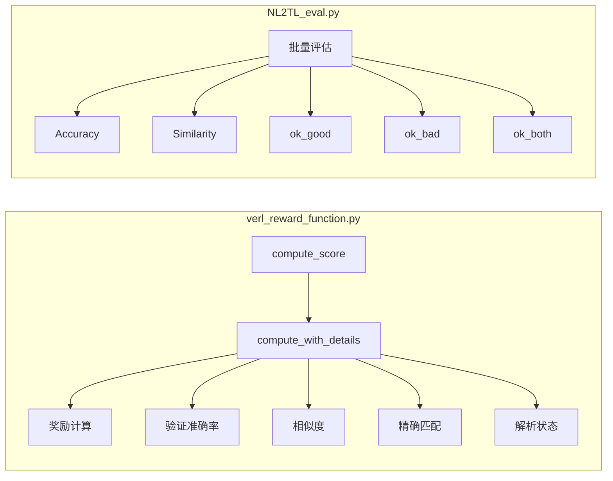
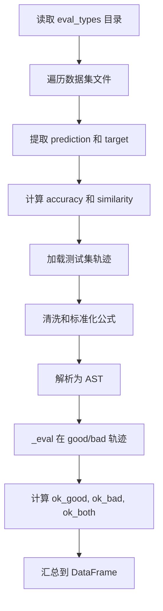
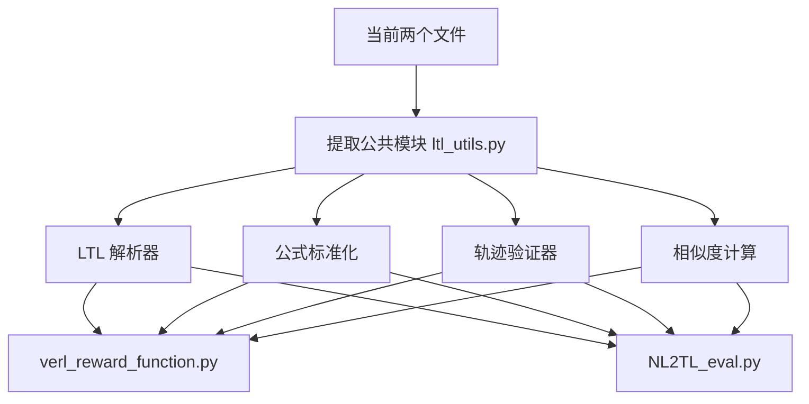

# VERL Reward Function 与 NL2TL_eval.py 对比分析文档

## 概述

本文档介绍了 [`verl_reward_function.py`](../verl_reward_function.py) 的功能实现，并将其与 [`NL2TL_eval.py`](../NL2TL_eval.py) 进行详细对比分析。

---

## 1. verl_reward_function.py 介绍

### 1.1 功能定位

`verl_reward_function.py` 是一个**轻量级 VERL（Verify and Reward Learning）奖励函数**，用于在强化学习训练过程中评估 LTL（Linear Temporal Logic）公式预测的质量。

### 1.2 核心 API

| 函数名 | 输入参数 | 输出 | 用途 |
|--------|----------|------|------|
| [`compute_score()`](verl_reward_function.py:341) | `data_source`, `solution_str`, `ground_truth`, `extra_info` | `float` | VERL 兼容的奖励计算接口 |
| [`compute_with_details()`](verl_reward_function.py:289) | `prediction`, `ground_truth`, `good_trace`, `bad_trace` | `Dict[str, Any]` | 详细的评估结果字典 |

### 1.3 奖励计算公式

```python
reward = (verif_acc + sim + exact_match) / 3   # 当解析成功时
reward = 0                                      # 当解析失败时 (bad_parse = 1)
```

其中：
- **`verif_acc`**: 验证准确率 = 0.5 × (good_sat + (1 - bad_sat))
- **`sim`**: 子串相似度（使用 SequenceMatcher）
- **`exact_match`**: 精确匹配标志

### 1.4 支持的 LTL 运算符

该模块支持有限轨迹语义下的以下 LTL 运算符：

| 运算符 | 含义 | 有限轨迹语义 |
|--------|------|-------------|
| `X φ` | Next | 在 min(t+1, len(trace)-1) 处评估（尾部停顿） |
| `F φ` | Finally | 在 [t, end] 范围内存在 k 使得 φ(k) 成立 |
| `G φ` | Globally | 在 [t, end] 范围内所有 k 都满足 φ |
| `φ U ψ` | Until | 存在 k 使得 ψ(k) 成立，且 [t, k) 范围内 φ 都成立 |
| `and` | Conjunction | - |
| `or` | Disjunction | - |
| `not` | Negation | - |
| `-->` | Implication | 转化为 `¬φ ∨ ψ` |

### 1.5 关键实现细节

#### 1.5.1 预测文本清洗 ([`_clean_prediction()`](verl_reward_function.py:55))

- 去除数字编号前缀（如 "1. "）
- 去除前缀：`LTL:`, `3. *FINAL:* `, `*FINAL:* `, `FINAL: `
- 去除后缀：`*FINISH*`, `FINISH`, `*END*`, `END`

#### 1.5.2 Token 标准化 ([`_normalize_tokens()`](verl_reward_function.py:137))

将自然语言表达转换为标准 LTL 符号：
```python
TOKEN_MAP = {
    "globally": "G", "always": "G", "[]": "G",
    "finally": "F", "eventually": "F", "<>": "F",
    "next": "X", "until": "U",
    "not": "not", "¬": "not", "!": "not",
    "&": "and", "∧": "and",
    "|": "or", "∨": "or", "or": "or",
    "imply": "-->", "implies": "-->", "->": "-->",
    "⇒": "-->", "-->": "-->", "double_implies": "-->"
}
```

#### 1.5.3 蕴含消除 ([`_elim_impl_tokens()`](verl_reward_function.py:152))

将蕴含运算符 `-->` 转换为 `¬φ ∨ ψ` 形式，便于 pyModelChecking 库解析。

#### 1.5.4 公式验证 ([`_validate_formula()`](verl_reward_function.py:212))

- 在 `good_trace`（正例轨迹）上验证公式是否满足
- 在 `bad_trace`（反例轨迹）上验证公式是否被违反

---

## 2. NL2TL_eval.py 介绍

### 2.1 功能定位

`NL2TL_eval.py` 是一个**离线评估脚本**，用于评估 NL2TL（Natural Language to LTL）翻译任务的性能。它从评估结果文件中读取预测，进行多维度指标计算。

### 2.2 评估指标

| 指标 | 说明 | 计算方式 |
|------|------|----------|
| **Accuracy** | 精确匹配率 | 预测 == 目标的样本比例 |
| **Similarity** | 子串相似度 | 最佳子串匹配的 SequenceMatcher 均值 |
| **ok_good** | 正例满足率 | good_trace 满足公式的样本比例 |
| **ok_bad** | 反例违反率 | bad_trace 被公式排除的样本比例 |
| **ok_both** | 完全正确率 | 同时满足 ok_good 和 ok_bad 的比例 |

### 2.3 核心函数

| 函数名 | 输入参数 | 输出 | 用途 |
|--------|----------|------|------|
| [`best_substring_similarity()`](NL2TL_eval.py:31) | `prediction`, `target` | `float` | 计算最佳子串相似度 |
| `_normalise_tokens()` | `tokens: List[str]` | `str` | Token 标准化 |
| `_elim_impl_tokens()` | `tokens: List[str]` | `List[str]` | 蕴含消除 |
| `_parse()` | `formula_str: str` | AST | 公式解析 |
| `_eval()` | `ast`, `trace`, `t` | `bool` | 公式在轨迹上的求值 |

---

## 3. 对比分析

### 3.1 架构设计差异

| 方面 | verl_reward_function.py | NL2TL_eval.py |
|------|------------------------|---------------|
| **设计目标** | 在线 RL 训练的奖励函数 | 离线批量评估脚本 |
| **接口风格** | 函数式 API，返回单个分数 | Jupyter Notebook 脚本 |
| **数据流** | 单条样本输入输出 | 批量读取 JSONL 文件 |
| **依赖注入** | 通过 `extra_info` 传入轨迹 | 从测试集文件读取 |

### 3.2 功能覆盖差异



### 3.3 代码复用分析

两个文件共享以下核心逻辑：

| 功能 | verl_reward_function.py | NL2TL_eval.py | 复用情况 |
|------|------------------------|---------------|----------|
| Token 映射 | [`TOKEN_MAP`](verl_reward_function.py:75) | [`TOKEN_MAP`](NL2TL_eval.py:105) | **几乎相同** |
| Token 标准化 | [`_normalize_tokens()`](verl_reward_function.py:137) | `_normalise_tokens()` | **几乎相同** |
| 蕴含消除 | [`_elim_impl_tokens()`](verl_reward_function.py:152) | `_elim_impl_tokens()` | **几乎相同** |
| 公式解析 | [`_parse_formula()`](verl_reward_function.py:200) 使用 `@lru_cache` | `_parse()` 使用 `@lru_cache` | **几乎相同** |
| 公式求值 | [`_eval_ast()`](verl_reward_function.py:221) | `_eval()` | **几乎相同** |
| 子串相似度 | [`_best_substring_similarity()`](verl_reward_function.py:269) | `best_substring_similarity()` | **相同逻辑** |

### 3.4 关键差异详解

#### 3.4.1 预测文本清洗

| 文件 | 实现 | 差异 |
|------|------|------|
| verl_reward_function.py | [`_clean_prediction()`](verl_reward_function.py:55) | 支持更多前缀/后缀 |
| NL2TL_eval.py | 内联实现（第306-313行） | 硬编码部分前缀后缀 |

#### 3.4.2 Tokenization 策略

| 文件 | 实现 | 差异 |
|------|------|------|
| verl_reward_function.py | [`_tokenise()`](verl_reward_function.py:102) | 支持多字符运算符 `[]`, `<>`, `-->`, `->` |
| NL2TL_eval.py | `_tokenise()`（第192行） | 使用 `re.findall(r"\w+|[()]")` 仅支持单词和括号 |

#### 3.4.3 错误处理

| 文件 | 实现 | 特点 |
|------|------|------|
| verl_reward_function.py | 在 [`compute_with_details()`](verl_reward_function.py:324-336) 中捕获异常，设置 `bad_parse=1` | 返回完整结果字典 |
| NL2TL_eval.py | 在循环中捕获异常（第256、321行） | 累加 `bad_parse` 计数器 |

#### 3.4.4 奖励计算 vs 离线指标

| 文件 | 计算方式 |
|------|---------|
| verl_reward_function.py | `reward = (verif_acc + sim + exact) / 3` |
| NL2TL_eval.py | 分别计算各指标，不做加权平均 |

### 3.5 数据结构差异

**verl_reward_function.py 的 extra_info 结构：**
```python
{
    "good_trace": List[Set[str]],  # 正例轨迹
    "bad_trace": List[Set[str]]    # 反例轨迹
}
```

**NL2TL_eval.py 的测试集结构：**
```python
{
    "id": str,
    "prop_dict": Dict[str, Dict],  # 原子命题映射
    "good_trace": List[List[str]],
    "bad_trace": List[List[str]]
}
```

---

## 4. 架构流程图

### 4.1 verl_reward_function.py 数据流

```mermaid
flowchart TD
    A[prediction输入] --> B[_clean_prediction]
    B --> C[计算 sim 和 exact_match]
    C --> D{extra_info存在?}
    D -->|否| E[reward = (0 + sim + exact) / 3]
    D -->|是| F[提取 good_trace, bad_trace]
    F --> G[_normalize_formula_string]
    G --> H[_validate_formula]
    H --> I[计算 verif_acc]
    I --> J[reward = (verif_acc + sim + exact) / 3]
    J --> K[返回结果字典]
```

### 4.2 NL2TL_eval.py 评估流程



---

## 5. 总结与建议

### 5.1 主要发现

1. **核心算法高度一致**：两个文件在 LTL 解析、标准化、蕴含消除、公式求值等核心逻辑上实现相同
2. **使用场景不同**：`verl_reward_function.py` 适合在线 RL 训练，`NL2TL_eval.py` 适合离线评估
3. **代码冗余**：存在大量重复代码，建议提取公共模块

### 5.2 重构建议



### 5.3 关键差异速查表

| 特性 | verl_reward_function.py | NL2TL_eval.py |
|------|------------------------|---------------|
| 主接口 | `compute_score()`, `compute_with_details()` | Notebook 脚本 |
| 输出格式 | 浮点分数或字典 | DataFrame |
| 错误处理 | 包含在返回值中 | 累加计数器 |
| 轨迹来源 | 参数传入 | 文件读取 |
| 支持多字符运算符 | ✅ 是 | ❌ 否 |
| 缓存优化 | `@lru_cache` | `@lru_cache` |
| 奖励公式 | 加权平均 | 独立指标 |
